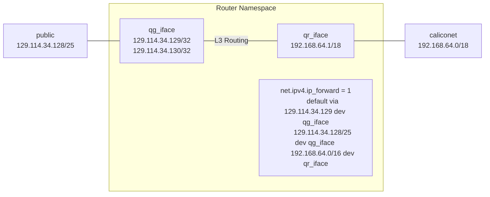
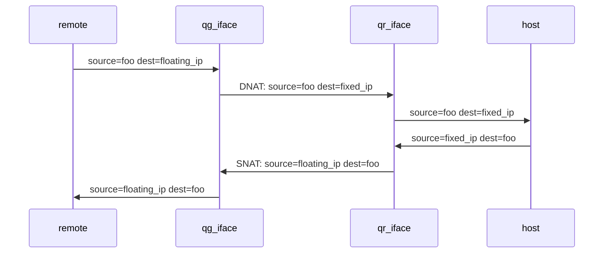
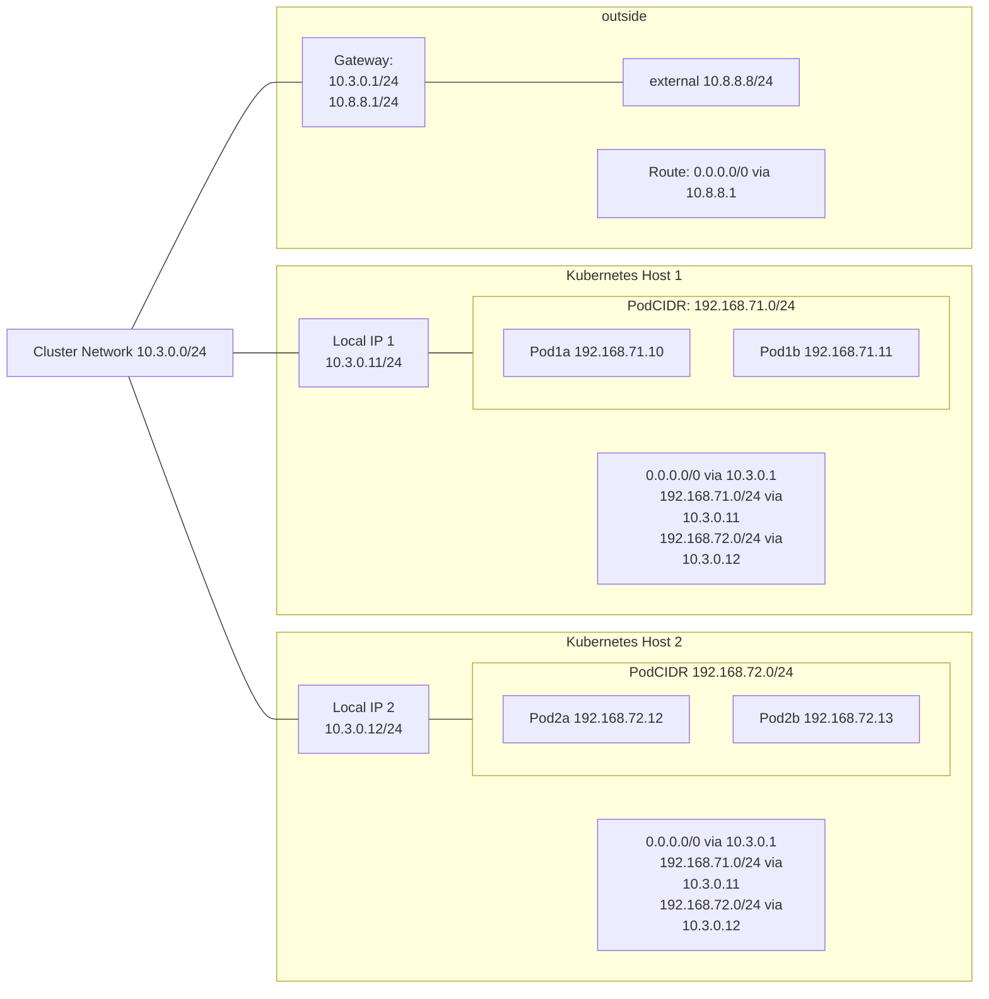
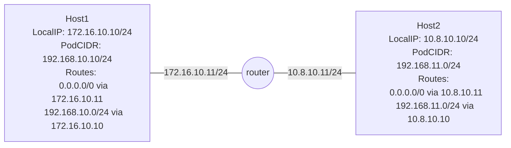
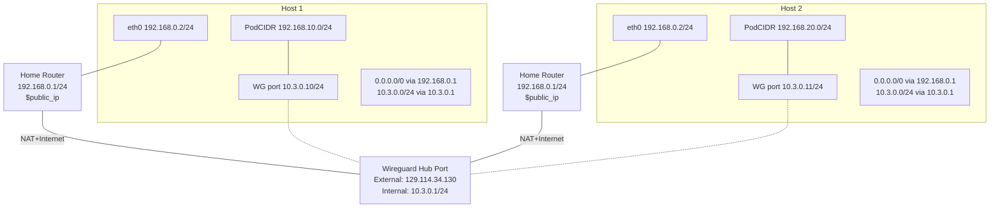
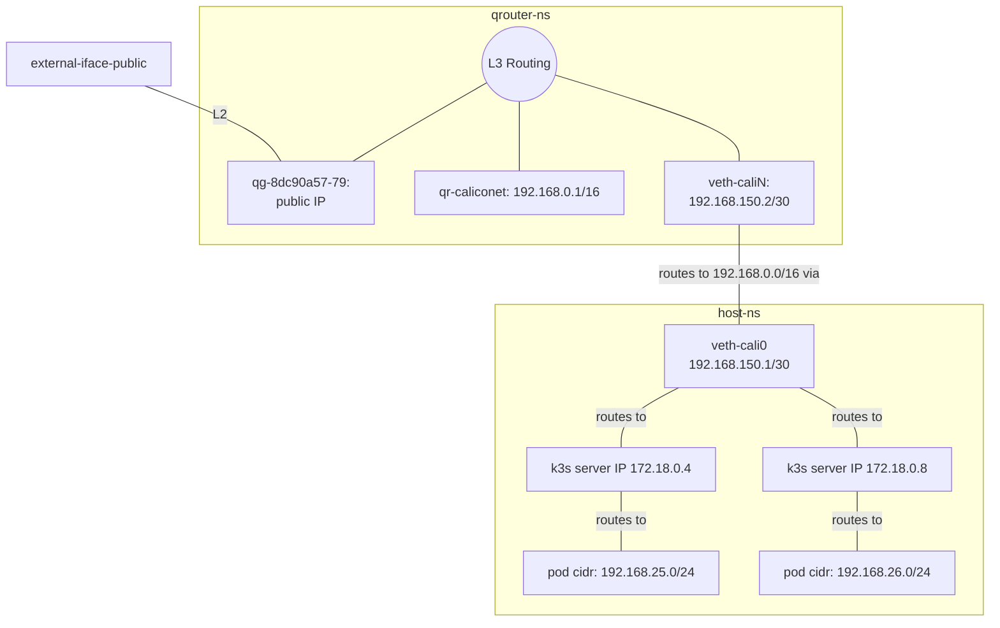
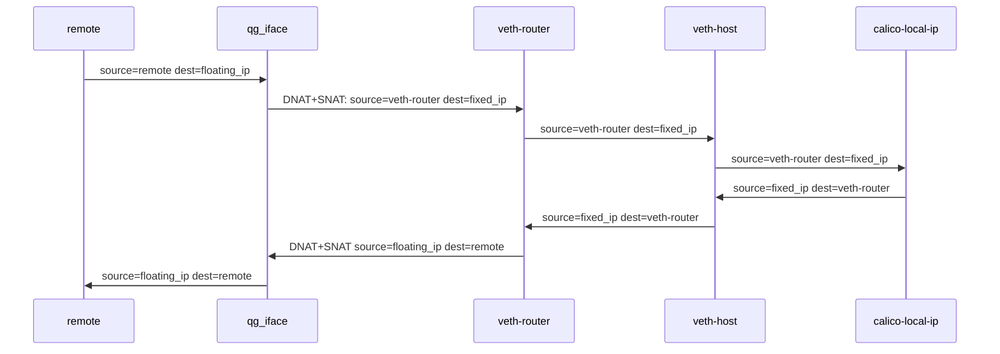

# CHI@Edge Networking

CHI@Edge makes different assumptions than "normal" openstack when it comes to networking.

While Neutron is still running, it is only used for floating IPs, and end-users don't create/delete networks, subnets, ports, or routers themselves.

Instead, the Calico CNI plugin for kubernetes is managing most networking, and all container -> container networking, and neutron and zun are configured to provide a minimal "shim" around this.

## Network Details

### Openstack's Perspective
As far as Openstack knows, there are only two networks, "Public" and "Caliconet", connected by a router.

This router is implemented by means of a linux network namespace, openvswitch ports (qg_iface and qr_iface) which map layer 2 traffic into that namespace, and a series of IPTables rules which configure routing between qg_iface and qr_iface.
By default, the `qg_iface` acts as the default route within the namespace, and other links (each a separare qr_iface) route to their local subnets.
For technical details, refer to [Neutron's Layer 3 Internals](https://docs.openstack.org/neutron/latest/contributor/internals/layer3.html)


When a floating IP is attached, neutron binds that address to `qg_iface` in the router namespace, and also sets up NAT to forward traffic to the mapped internal address.

We'll refer to the external address as `floating_ip`, and the internal one as `fixed_ip`.


1. Initially, a packet arriving from outside has some `source_address=foo`, and `destination_address=floating_ip`.
2. It arrives at qg_iface, and iptables applies "destination nat (DNAT)" to rewrite the destination IP address. Now, `source_address=foo` and `destination_address=fixed_ip`
3. As `destination_address=fixed_ip`, the routing table indicates it should be forwarded via `qr_iface`, and it's sent off into caliconet
4. If a host were listening on `fixed_ip`, and connected to `caliconet` at layer 2, it would receive this packet and be able to respond. Its reply would have `source_address=fixed_ip` and `destination_address=foo`.
5. On the way back out, the packet would be received at `qr_iface`, and IPtables apply source NAT (SNAT), rewriting `source_address=fixed_ip` to `source_address=floating_ip`
6. the packet then leaves via `qg_iface`, having `source_address=floating_ip`,`destination_address=foo`, and is routed back to the intiial sender.


### Calico's Perspective

Calico sees the world differently, and is primarily concerned about routing between kubernetes hosts. Using the below diagram, we'll look at how traffic flows between a few different pairs of endpoints.



We start with the assumption that Local IP 1 and Local IP 2 can communicate directly with each other at layer 2, as it's the simplest.

* Traffic between two pods on the same host, or between the host's local IP and its own pods, is sent directly with no NAT or encapsulation.
* Traffic from pods on one host to the local IP of another host (or other "endpoints" calico is aware of), is also sent directly, as the source and destination addresses still match the locally connected routes. (Depending on config, it could also be routed via local-ip)
* Traffic from pods on one host to pods on another host is routed, using the destination host's "local ip" as the next-hop
* in contrast, traffic from pods to the "outside" has source NAT applied before leaving the host, since the network outside of Calico wouldn't be aware of how to return traffic to the pod IPs.

| Source               | Destination               |    Method  |
|----------------------|---------------------------|------------|
|  Pod1a 192.168.71.10 |   Pod1b 192.168.71.10     | Forwarded  |
|  Pod1a 192.168.71.10 |   Host1 10.3.0.11         | Fwd/Routed |
|  Pod1a 192.168.71.10 |   Host2 10.3.0.11         | Fwd/Routed |
|  Pod1a 192.168.71.10 |   Pod2a 192.168.73.12     | Routed     |
|  Pod1a 192.168.71.10 |   "outside" 10.8.8.8      | SNAT + Routed |


### What if our hosts *can't* talk directly? (Router Cluster Net)

We may have a more complicated setup, where extra work is needed for hosts to communicate between their local-ips.



In this case, although host1 and host2 aren't in the same subnet, they can still route traffic to each other,\
since the default route will handle sending from 172.16.10.10 -> 10.8.10.10 and vice-versa.

However, we can no longer simply route traffic from pods on host1 to pods on host2, the router will have no idea what to do with a destination address of 192.168.11.1, as it doesn't have a route for it. To work around this, Calico can be configured to apply ip-ip or vxlan encapsulaton to the pod traffic before sending it to the router, and the destination host will de-encapsulate it upon recepit.


### Or if they're in really difficult places? (Wireguard Cluster Net)

One of our common deployment scenarios is "put a kubernetes host on someone's home router, behind NAT and a firewall, and make this all work anyway.
To do this, we replace the conceptual "cluster network" with a wireguard-based underlay network.



In this arrangement, each host only has outbound connectivity, since it's sitting behind NAT of their home router. In fact, multiple defvices may have the same IP address, since their local networks aren't coordinated.

We maintain a wireguard service which listens at a publicly routable IP address, (the `hub port`), and wireguard clients on each host initiate a connection to this service, through their nat+firewall. [Wireguard has nice docs about this here.](https://www.wireguard.com/quickstart/#nat-and-firewall-traversal-persistence)

Now, our "local-ip" is the wireguard interface on each host. Each host is configured to reach all addresses in the wireguard subnet by first sending to the hub port, which acts as a router, but the "wireguard router" doesn't know how to reach the PodCIDRs. This reduces to the same as our "Routed" case above, and we can get it all working by using either ip-ip or vxlan encapsulation, before forwarding packets to the wireguard interface.

Looking at the routing table, we see that regular "outbound" traffic doesn't depend on the wireguard tunnel (this is good, otherwise we couldn't reach the wireguard hub's public IP in the first place). In practice, this means that traffic between pods on the same host, or from pods out to the public internet, doesn't traverse the tunnel at all, so the tunnel is used *only* for traffic that must pass between hosts.

An unfortunate downside of this architecture is that devices that are locally connected can't take advantage of this short path, and still send traffic "the long way" via the hub port.


### Connecting them together (Openstack Floating IPs with Calico Net)

From what we've gone through above, we arrive at the following requirements:

1. Neutron needs to have its own, neutron-managed subnet in order to have a "fixed_ip" for floating IPs
2. This subnet must == the calico IPPool, so that we can use any PodCIDR as a fixed_ip
3. But, neutron will want to route traffic to this subnet directly, and we know this won't work.
   1. Neutron doesn't know to use the kuberneres local-ips as nexthops for each PodCidr

To solve this, we first realize that each system running calico on it *does* know how to route to all of the PodCIDRs, and this includes our Openstack controller node (since it's running a k3s server too). We just need to get the traffic out of the neutron router namespace, and into the host namespace where those routes are.

We accomplish this in a few steps:

First, create a veth-pair, and add one half to the router namespace, establishing a layer 2 connection from the router NS into the host NS.
Second, configure IP addresses on both ends of the veth-pair, so that we can route across it.
And finally, remove neutron's existing route for caliconet, instead use the "host" end of our veth-pair as the next-hop.




Now, when neutron sends traffic to addresses in 192.168.0.0/16 (both the neutron subnet cidr and the kubernetes cluster CIDR), it will first be sent to 192.168.150.1 in the host NS. There, Calico has alreday populated routes to each of the PodCIDRs, and traffic will be sent to the appropriate next-hop.

We have one remaining issue: As mentioned above, "DNAT" on traffic arriving via floating IPs, so when the packets arrive at the calico local-ip, they will have `source_address=remote`, `dest_address=fixed_ip`, and this will get routed correctly to the pod. But, the reply won't come back using the same path. Calico will use its existing routes for the `remote` address, being somewhere on hte internet, instead of sending traffic back through neutron where SNAT would have been applied. The remote host will see two very different source addresses, and this breaks the majority of two-way communication.

To address this, ideally we would inject routes into calico for each neutron floating IP, but this was not straightforward at the time of writing. Instead, we add an additional SNAT rule to the neutron router, such that packets are sent to calico with `source_address=veth-router`, instead of `remote`. Calico knows that the veth-pair's subnet is on the controller node, and so reply traffic is sent back along this path.

Instead of the first sequence, now it looks like this:




## Configuration


To start with, we need to know/define the kubernetes cluster CIDR.
We specified this either during installation, or it can be found by running:
`kubectl get installations default -o json  | jq '.spec.calicoNetwork.ipPools'`

Which will output something like:
```
[
  {
    "allowedUses": [
      "Workload",
      "Tunnel"
    ],
    "blockSize": 26,
    "cidr": "192.168.0.0/16",
    "disableBGPExport": false,
    "disableNewAllocations": false,
    "encapsulation": "VXLANCrossSubnet",
    "name": "default-ipv4-ippool",
    "natOutgoing": "Enabled",
    "nodeSelector": "all()"
  }
]
```

So in our example, the cluster CIDR is `192.168.0.0/16`

We also are concerned with the subnet used for Openstack API traffic, corresponding to the subnet for `kolla_internal_vip_address` in our kolla-ansible config. Here, that is `172.18.200.0/24`

Finally, we need to know what CIDR we'll use for Neutron-managed floating IPs. Here, we've chosen the same CIDR as the API, also `172.18.200.0/24`. We'll need to be careful not to select overlapping ranges.


We now have our minimum necessary networks to get things working:

- ClusterCIDR: `192.168.0.0/16`
- Neutron Public CIDR: `172.18.200.0/24`

We'll set up some neutron networks corresponding to these. On our networking node, the "public" subnet/network/cider is present with no vlan tags, in the host namespace, so we'll use provider-network-type "flat"

```
openstack network create \
    --provider-physical-network physnet1 \
    --provider-network-type flat \
    --external \
    --default \
    public

openstack subnet create \
    --network public \
    --subnet-range 172.18.200.0/24 \
    --no-dhcp \
    --gateway 172.18.200.1 \
    public
```

And again for our "internal" network, which will let us map floating IPs onto ones in the calico network.

```
openstack network create caliconet
openstack subnet create \
    --network caliconet \
    --subnet-range 192.168.0.0/16 \
    --no-dhcp \
    caliconet
```

And a neutron router to handle NAT from caliconet -> public
```
openstack router create --external-gateway public public
openstack router add subnet public caliconet
```

Finally, we need to do some fiddling to bridge the neutron router NS with the calico router NS

``` console
# create a veth pair
ip link add veth-cali0 type veth peer veth-caliN
ip link set veth-cali0 up
ip link set veth-caliN up

ip addr add 192.168.150.1/30 dev veth-cali0
ip addr add 192.168.150.2/30 dev veth-caliN
```

<!-- 192.168.233.64/26 via 172.19.0.4 -->

### Verifying L3 connectivity

now that we have both subnets and a router, lets verify a few things.

#### Reaching the router's public IP

The router should be reachable via the public IPv4 internet, or on a dev site, at least from your control/testing host.

Get the router's IP: 
ubuntu@ciablocal:~/chi-in-a-box$ openstack router show public -c external_gateway_info -f json

```json
{
  "external_gateway_info": {
    "network_id": "1ff8a6f2-5947-4921-b994-fd3d3cdeb160",
    "external_fixed_ips": [
      {
        "subnet_id": "fc8393c4-9f91-4c28-af6d-18eadd98c66d",
        "ip_address": "172.18.200.169"
      }
    ],
    "enable_snat": true
  }
}
``` 

```console
ubuntu@ciablocal:~/chi-in-a-box$ ping 172.18.200.169
PING 172.18.200.169 (172.18.200.169) 56(84) bytes of data.
64 bytes from 172.18.200.169: icmp_seq=1 ttl=64 time=0.598 ms
64 bytes from 172.18.200.169: icmp_seq=2 ttl=64 time=0.063 ms
```
