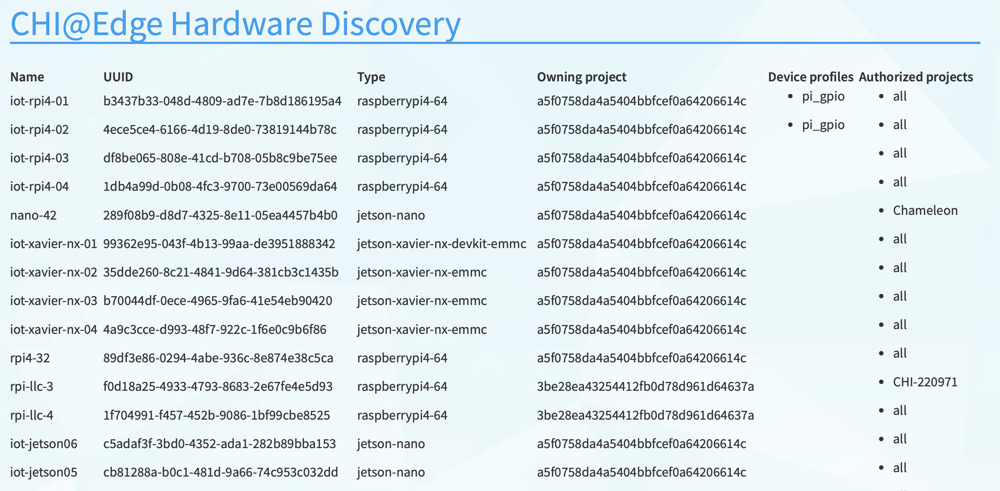

# Getting started

Whether you're using existing devices or wich to enroll your device(s) into the testbed and use them in your edge research, you must first be associated with an active Chameleon allocation. This guide covers this process, and also provides a tutorial for basic usage of the testbed GUI.

### Step 1: Log in to Chameleon

Just click the “Log in” button situated in the top right corner of [our main page](https://www.chameleoncloud.org) – you probably won’t even need to create an account!

If your institution is a member of [InCommon](https://incommon.org/federation) (most US research and education institutions are) – or if you have a Google account – you can log in with your institutional/Google credentials via the federated login. Otherwise, the log in process will guide you to create an account ([read more about logging into Chameleon via federated login](https://chameleoncloud.readthedocs.io/en/latest/user/federation.html#federation)).

On your first Chameleon login you will be asked to accept [terms and conditions](https://auth.chameleoncloud.org/auth/realms/chameleon/terms) of use. Please, note that as part of those terms and conditions you are requested to acknowledge Chameleon in publications produced using the testbed: see our FAQ for information on [how to reference Chameleon in your publications](https://www.chameleoncloud.org/learn/frequently-asked-questions/#toc-how-should-i-reference-chameleon-) and the suggested [acknowledgement text](https://www.chameleoncloud.org/learn/frequently-asked-questions/#toc-how-should-i-acknowledge-chameleon-in-my-publications-).

Once you log in, you will be able to [edit your Chameleon profile](https://chameleoncloud.readthedocs.io/en/latest/user/profile.html#profile-page), sign up for webinars, and participate in our community. However, to actually use the testbed you will first need to **join or create a project** (see below).

### Step 2: Create or join a project

To get access to Chameleon resources, you will need to be associated with a **project** that is assigned a **resource allocation**.

If you want to **join an existing Chameleon project**, you will need to ask the PI of the project to add your username. You can find your username in [your Chameleon profile](https://www.chameleoncloud.org/user/profile/)–it is also displayed in the top-right corner when you are logged in.

If you want to **create a project**, you will first either need to obtain a PI status or work with somebody who has PI status. To determine if you can obtain PI status, please see a [list of PI eligibility criteria](https://chameleoncloud.readthedocs.io/en/latest/user/pi_eligibility.html#pi-eligibility). If you do not meet these criteria (e.g., students generally do not), you will need to ask your advisor or other scientist supervising your research to create the project for you. You can request PI status by checking a box in [your Chameleon profile](https://www.chameleoncloud.org/user/profile/). Chameleon PI status requests are typically reviewed within one business day.

Once you have PI status, you may apply for a new project with an initial allocation. A project application typically consists of a short description of your intended research and takes one business day to process. Once your project has been approved, you will be able to utilize the testbed sites.

### Step 3: Start using Chameleon!

Congratulations, you are now ready to launch your first container! Containers are a simple way to deploy applications. Learn more about what containers are with [this guide from docker](https://www.docker.com/resources/what-container). Follow these steps to launch a container and manage it.

#### The CHI@Edge dashboard

Chameleon Edge resources are available through [CHI@Edge](https://chi.edge.chameleoncloud.org). When you access this site, you are first taken to a dashboard, which shows a summary of your project’s current resource usage. The dashboard looks something like this:


#### The CHI@Edge Hardware discovery page

Visit the hardware discovery page for edge devices by going to [this link](https://chameleoncloud.org/experiment/chiedge/hardware-info/). The landing page serves as a broad description of our deployment while the auto-updated [table](https://www.chameleoncloud.org/edge/hardware/) lets you discover what kind of resources are currently hosted in CHI@Edge with various information about hardware model, supported peripherals, current OS Kernel, device location, and more...

<figure><figcaption><p>A picture of the hardware discovery page</p></figcaption></figure>

#### The Lease Calendar

Visit the calendar for edge devices by going to [this link](https://chi.edge.chameleoncloud.org/project/leases/calendar/device/). This calendar lets you discover when resources are available to use. The _Y_ axis of this chart represents the different edge devices in the system, and the _X_ axis represents time.


#### Create a Reservation

To get access to an edge device, you can reserve it. Here, we provide instructions for using reservations, which can be skipped if a reservation is not needed. We include instructions for using either the dashboard interface or CLI.

**Create a Reservation Using the Dashboard**

After navigating to the [CHI@Edge](https://chi.edge.chameleoncloud.org) dashboard, follow these instructions to create a reservation.

1. In the sidebar, click _Reservations_, then click _Leases_
2. Click on the _+ Create Lease_ button in the toolbar
3. Enter a name, for example _my\_first\_lease_
4. Update the start date and time, along with the end date and time.
5. Next to _General_ at the top, select _Devices_. Here, enter 1 for both the minimum and maximum number of devices. You can also add a device filter for a specific type of edge device.
6. Click _Create_.


Your reservation will show in the list of leases. Once the status changes from _PENDING_ to _ACTIVE_, you can launch a container. Before you can do this, you must get the reservation ID of a device. Click on your lease name from the Leases overview to see the _Lease Detail_ page. Under the _Reservations_ header, you will see an _id_ field. Note this value. For example in the following figure, the value is _0e4a0c01-c597-4294-a926-6350af77c5d4_.


**Create a Reservation Using the CLI**

If you have previously installed blazar, you will need to reinstall to add in the new changes for edge devices

```shell
pip install git+shttps://github.com/chameleoncloud/python-blazarclient@chameleoncloud/stable/train
```

Be sure to use the OpenStack RC file downloaded from the Edge site. To get this file, first log in to the GUI dashboard at [CHI@Edge](https://chi.edge.chameleoncloud.org). Once there, follow the [same instructions](https://chameleoncloud.readthedocs.io/en/latest/technical/cli.html#cli-rc-script) as is done on the other sites to download this file.

To create a lease, use the `lease-create` command. The following arguments are required:

* `--reservation` with `resource_type=device`, `min`, `max`, and `resource_properties` attributes
* `--start-date` in `YYYY-MM-DD HH:MM` format
* `--end-date` in `YYYY-MM-DD HH:MM` format
* A lease name.

The attribute `resource_properties` may be used to specify what sort of edge device you want to reserve. For example, to reserve a Raspberry Pi from June 24, 2021 at 3:00pm to June 25, 2021 at 1:00pm, with the name `my-first-lease`, you may use the following command:

```shell
blazar lease-create \
  --reservation resource_type=device,min=1,max=1,resource_properties='["==", "$vendor", "Raspberry Pi"]' \
  --start-date "2021-06-24 15:00" --end-date "2021-06-25 13:00" \
  my-first-lease
```

You may also use the device name to reserve a specific device. For example, to reserve the device named `rpi3-01`, you can change your command like below:

```shell
blazar lease-create \
  --reservation resource_type=device,min=1,max=1,resource_properties='["==", "$name", "rpi3-01"]' \
  --start-date "2021-06-24 15:00" --end-date "2021-06-25 13:00" \
  my-first-lease
```

The output of `lease-create` should look like

```
+--------------+-----------------------------------------------------------------------+
| Field        | Value                                                                 |
+--------------+-----------------------------------------------------------------------+
| created_at   | 2021-06-24 15:43:36                                                   |
| degraded     | False                                                                 |
| end_date     | 2021-06-25T13:00:00.000000                                            |
| events       | {                                                                     |
|              |     "created_at": "2021-06-24 15:43:36",                              |
|              |     "updated_at": null,                                               |
|              |     "id": "243988c9-5e04-484e-991e-e9a19bc107f9",                     |
|              |     "lease_id": "8aad6912-2eb5-4140-812f-123e5cb56ca3",               |
|              |     "event_type": "end_lease",                                        |
|              |     "time": "2021-06-25T13:00:00.000000",                             |
|              |     "status": "UNDONE"                                                |
|              | }                                                                     |
|              | {                                                                     |
|              |     "created_at": "2021-06-24 15:43:36",                              |
|              |     "updated_at": null,                                               |
|              |     "id": "8aa2f211-9434-4ae0-a01a-e454e0a045e7",                     |
|              |     "lease_id": "8aad6912-2eb5-4140-812f-123e5cb56ca3",               |
|              |     "event_type": "before_end_lease",                                 |
|              |     "time": "2021-06-24T15:45:00.000000",                             |
|              |     "status": "UNDONE"                                                |
|              | }                                                                     |
|              | {                                                                     |
|              |     "created_at": "2021-06-24 15:43:36",                              |
|              |     "updated_at": null,                                               |
|              |     "id": "e8892924-649a-4beb-aa46-9e16f6331dab",                     |
|              |     "lease_id": "8aad6912-2eb5-4140-812f-123e5cb56ca3",               |
|              |     "event_type": "start_lease",                                      |
|              |     "time": "2021-06-24T15:45:00.000000",                             |
|              |     "status": "UNDONE"                                                |
|              | }                                                                     |
| id           | 8aad6912-2eb5-4140-812f-123e5cb56ca3                                  |
| name         | my-first-lease                                                        |
| project_id   | a5f0758da4a5404bbfcef0a64206614c                                      |
| reservations | {                                                                     |
|              |     "created_at": "2021-06-24 15:43:36",                              |
|              |     "updated_at": "2021-06-24 15:43:36",                              |
|              |     "id": "500e0c36-2089-46a5-bf7c-cc46e5f65a0d",                     |
|              |     "lease_id": "8aad6912-2eb5-4140-812f-123e5cb56ca3",               |
|              |     "resource_id": "48001fa1-ccb5-4e30-b511-a90455930776",            |
|              |     "resource_type": "device",                                        |
|              |     "status": "pending",                                              |
|              |     "missing_resources": false,                                       |
|              |     "resources_changed": false,                                       |
|              |     "resource_properties": "[\"==\", \"$vendor\", \"Raspberry Pi\"]", |
|              |     "before_end": "default",                                          |
|              |     "min": 1,                                                         |
|              |     "max": 1                                                          |
|              | }                                                                     |
| start_date   | 2021-06-24T15:45:00.000000                                            |
| status       | PENDING                                                               |
| trust_id     | ec2a893aa0494d72bcc5fbb3b73e7e66                                      |
| updated_at   | 2021-06-24 15:43:36                                                   |
| user_id      | b8f54aa95b96b9fb69e31a3e39df6a7bad29581439cf8bd8c9d59d9d7d048f3a      |
+--------------+-----------------------------------------------------------------------+
```

Look for the _reservations_ entry, and within this item find the _id_ entry. In the above example, this is _500e0c36-2089-46a5-bf7c-cc46e5f65a0d_. Save this value someone, as it will be used later. Note that this is not the value from the row with _id_ in the left column.

Note

It may take up to a minute for your reservation to change from PENDING to ACTIVE status. One the lease becomes ACTIVE, you can use it.

At this point, you can return to the GUI to continue setting up your container.

#### Launching a container

To launch a container, follow the following steps:

1. In the sidebar, click _Container_, then click _Containers_.
2. Click on the _Create Container_ button in the toolbar and the _Create Container_ wizard will load
3. Give your container a name. For example, since it’s your first container, _my\_first\_container_ may be a good name. Then, enter the name of an image you want to launch from Docker Hub. You must use the full name of the image. Optionally, you can supply a custom command to override the default command run by Docker.


Only the ARM architecture is currently supported. Make sure the image used is compatible with ARM. [Here is a list of such images on Docker Hub](https://hub.docker.com/search?type=image\&architecture=arm64).



1.  Click _Scheduler Hints_ in the sidebar. Next to custom, enter “reservation” and click the _+_ sign. It will move to the right, and there enter the reservation ID saved from the `lease-create` step.

    
2. In the same _Scheduler Hints_ dialog, enter a new hint called "platform\_version" and click the + sign, then enter "2" into the value. This is required while we are migrating existing devices to the new platform, which supports open enrollment.
3. Click the _Create_ button.

Congratulations, you have launched a container! It may take a few minutes for your container to become active if the image is not yet downloaded to the target device.

**Launching with a Device Profile**

For some functions, extra setup must take place while a container is launched. For example, to use a camera, docker needs to load the device. This setup is handled by launching your container with a device profile. You can see what device profiles work with each device on our [table of current hardware](https://chameleoncloud.org/experiment/chiedge/hardware-info/).

Additionally, all devices support the profile `cap_net_admin`, which gives adds the capability `CAP_NET_ADMIN` to a container.

To use a device profile, you must launch your container using the CLI or the python interface, python-chi. In the CLI, a device profile is used by adding the argument `--device-profile "<profile_name>"`. With python-chi, you can include `device_profiles=["<profile_name>"]` as a keyword argument to `container.create_container`.

#### Associating an IP address

For your container to be accessible over the Internet, you need to first assign a floating IP address.

1. First, select your container name in the _Containers_ page, which will bring you to an overview for the container. Under _Spec_, you will see a field titled _Addresses_ and within this, you should see an IP address next to the text _addr_. Note this address.
2.  Go to the _Floating IP_ dashboard by clicking on _Network_ and _Floating IPs_ in the sidebar.

    
3.  If you have a Floating IP not currently associated to a container, click the _Associate_ button for the IP. A dialog will load that allows you to assign a publicly accessible IP to your container. Under _Port to be associated_, use the IP address from the container overview from step 1. Click the _Associate_ button in the dialog to complete the process of associating the public IP to your container.

    

    Here you can assign a floating IP address
4.  If you didn’t already have a Floating IP available, you may allocate one to your project by clicking on the _Allocate IP to Project_ button along the top row in the Floating IP dashboard. A new dialog will open for allocating the floating IP.

    

    This dialog allows you to allocate an IP address from Chameleon’s public IP pool

    Click the _Allocate IP_ button. The Floating IP dashboard will reload and you should see your new Floating IP appear in the list. You can now go back to step 3.

#### Access to your container

Once your container has launched, there are a few ways to interact with it.

If your container communicates over the network, you can use the assigned floating IP to access it. For example, if your container is running a web server on port `8888`, with floating IP `129.114.108.102`, you can connect to it by going to `http://129.114.108.102:8888` in your browser.

By selecting your container name from the list of containers, you will be taken to an overview page for your container. Here, you can select the logs tab to see the output from your container. In the top right of this page, next to the button labeled _Refresh_, you can select the drop-down arrow. One of the options in this drop-down menu is _Execute Command_. Clicking this will open a window, allowing you to enter a command to execute on your container. The output from this command will then be displayed, after the command runs. In the future, you will be able to connect to your container via the _Console_ tab, but for the moment this is not supported.
